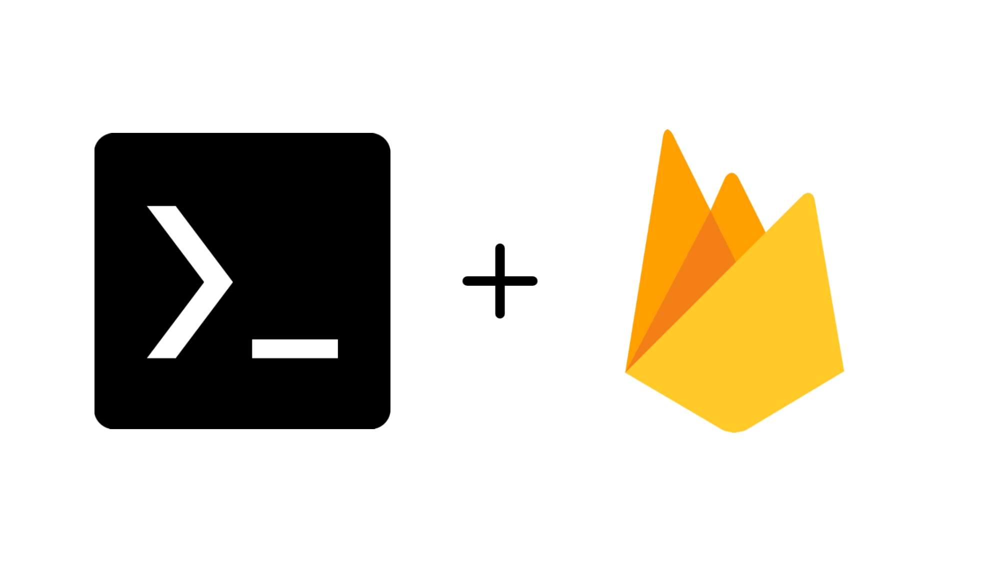

# T - Fire

---

# Installation

# Before 
Before installing this file make a folder to your phone's internal Storage named : #Coding (Same as it is) and remember don't delete it or don't keep any other things in it...

#Setup Storage
termux-setup-storage

## Install Git
pkg install git

## Clone the Repository
git clone https://github.com/gauravprajapati23/t-fire
 
cd t-fire
 
chmod +x *

## Run Setup Script
./setup.sh

## Run Initialising Script
./init.sh

## Run Hosting Script
./host.sh

---

## Collaborators ✨

  

# Description
This script was created to help the android user to host there websites with fire base easily and also to manage index file properly by storing it in file storage and seperate folders.
